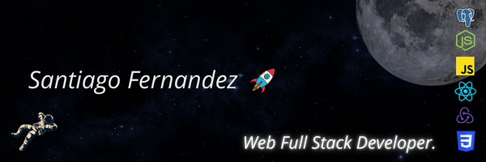
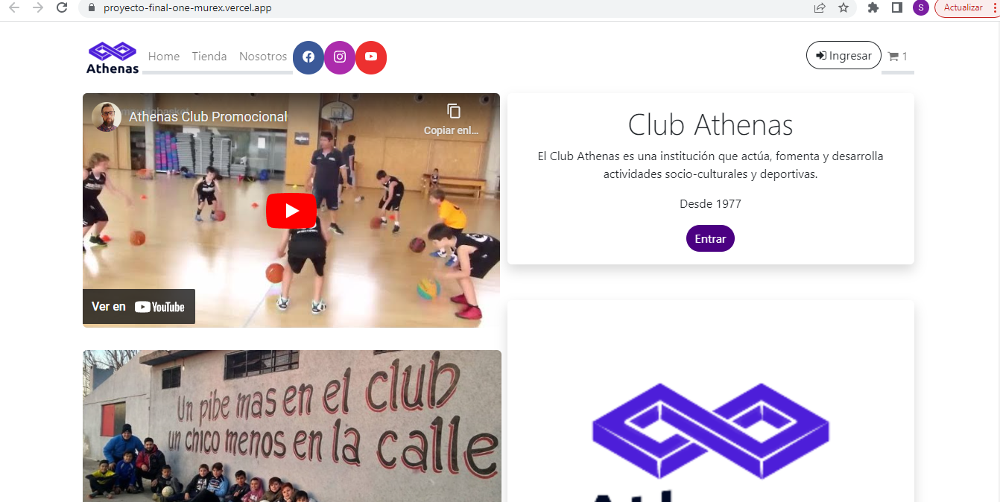
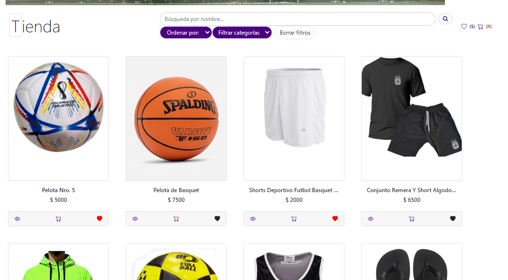
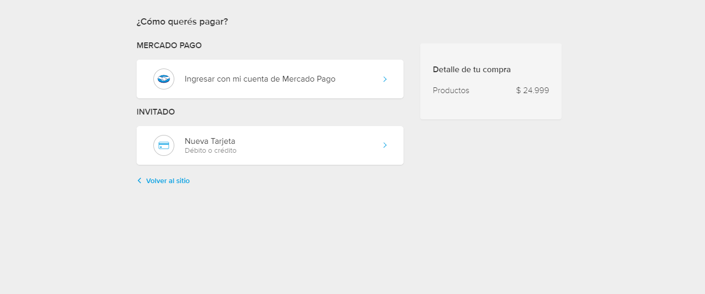
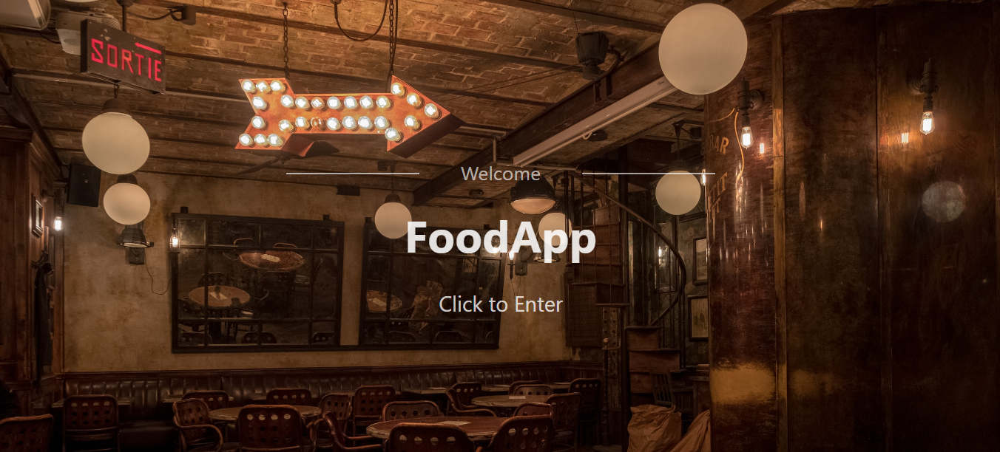
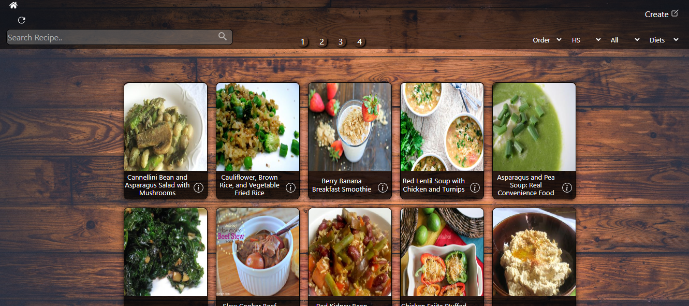
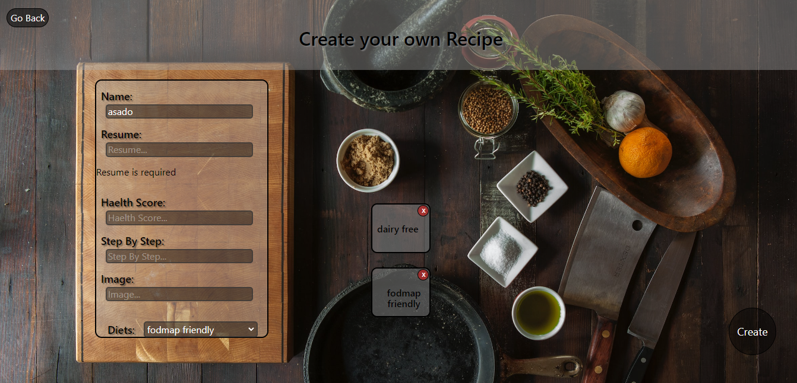
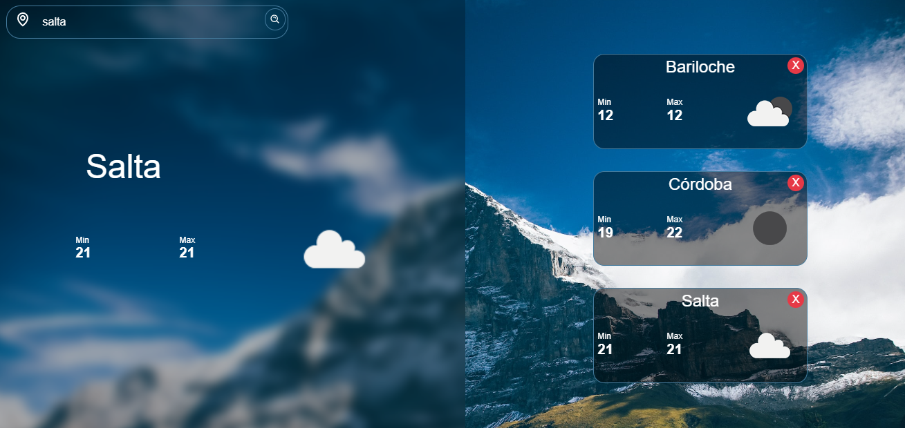
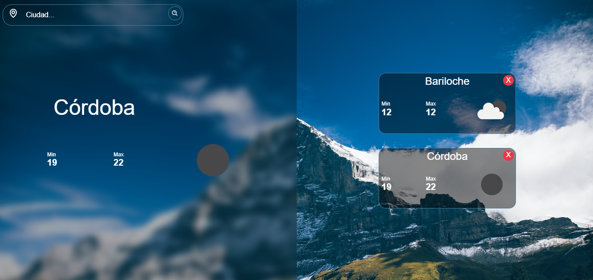

<h1 align="center">  </h1>
<h3 align="center">Hi 👋I'm Santiago Fernandez and I am a Full-Stack Developer Jr. I formed myself in the SoyHenry bootcamp, an intensive course for Full-Stack Web Developer, which counts with 800+ hours of practicing and learning. Technologies I work with: 

<h3>Javascript | SQL | React | Redux | HTML | Bootstrap | CSS | Node.js | Express | Sequelize | PostgreSQL | SQLite | Scrum | GIT - GIT-flow |</h3>

<h3>As a Full-Stack, I know how to perform myself in DB, Front-End and Back-End, without an specific preference over any of them at the moment of working. I am very good at solving and facing problems and new tasks. I have knowledge in Git and teamwork with agile methodologies, SCRUM. I am always learning new technologies and mastering the ones I already know.</h3></h3>

<h2>👨‍💻 My Proyects: </h2>

- ⚡Proyect - AthenasClubApp
[Athenas Club](https://proyecto-final-one-murex.vercel.app) --
[Athenas Club Repo](https://github.com/MATarg81/proyecto-final)
   <h3> SPA, administrative App for a club with an e-commerce integrated</h3>
    
    
    

- ⚡My Food App 
[FoodApp](https://sansfoodapp.netlify.app/) --
[FoodAppRepo](https://github.com/San896/PIFood)
  <h3> SPA, a App of Food Recipes, yo can search, filter and create recipes</h3>
    
    
    

- ⚡My Wheather App 
[FoodApp](https://wheathersf.netlify.app/) --
[FoodAppRepo](https://github.com/San896/WheatherApp)
  <h3> SPA, a App of Food Recipes, yo can search, filter and create recipes</h3>
    
    
    

  <h3> Contact me! </h3>

- 📫 How to reach me **sannlfernandez8@gmail.com**

<h3 align="left">Connect with me:</h3>

<h3 align="left">Languages and Tools:</h3>

                  

